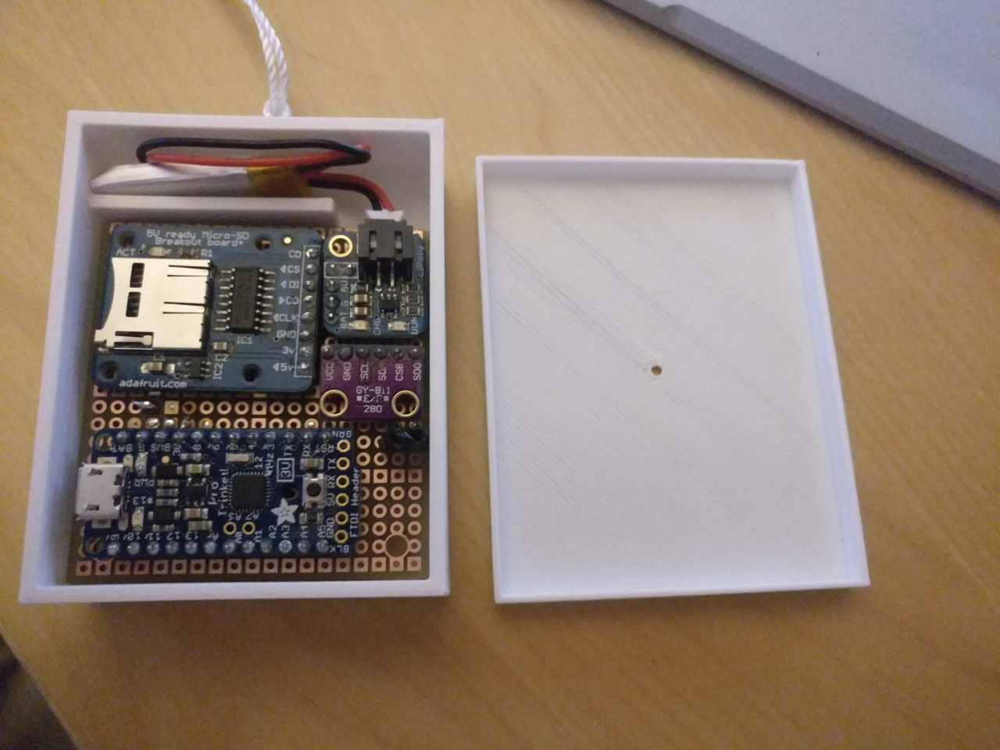

# Kite Payload

An Arduino powered data logger, that collects pressure/altitude and saves data to a microSD card

## Data Format

The device logs measurements to the microSD card. It will attempt to create a CSV file called `FLIGHTXX.CSV` where XX is a 2 digit number (like `FLIGHT00.CSV`). It will write to the first numbered file that doesn't already exist.

The data is logged like:

`time,pressure,temperature`

 - time is a number that increments by 1 every 2 seconds
 - pressure is in hPa
 - temperature is in C

Data is logged every 2 seconds (or whatever arduino thinks is 2 seconds, which might be wayyy off)

[Example CSV](FLIGHT00.CSV)

## Parts

 1. [Pro Trinket 3V](https://www.adafruit.com/product/2010)
 2. [MicroSD card breakout board](https://www.adafruit.com/product/254)
 3. [LiIon/LiPoly Backpack Add-On](https://www.adafruit.com/product/2124)
 4. [GY-BMP280-3.3 High Precision Atmospheric Pressure Sensor](https://www.banggood.com/GY-BMP280-3_3-High-Precision-Atmospheric-Pressure-Sensor-Module-For-Arduino-p-1111135.html)
 5. [Lithium Ion Polymer Battery (100 mAh)](https://www.adafruit.com/product/1570)

 ## Case

 You can find the 2 parts to the case in this repo,`kite payload proto box.stl` and `kite payload proto lid.stl`